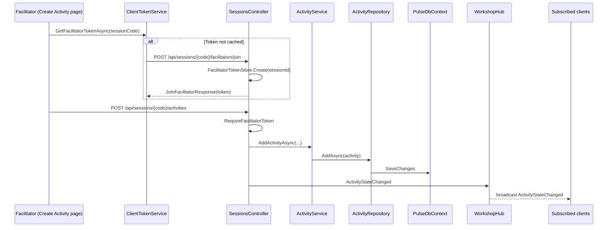
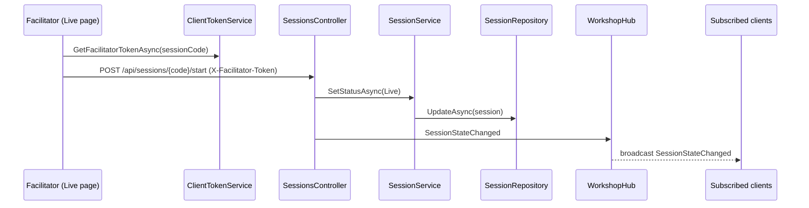
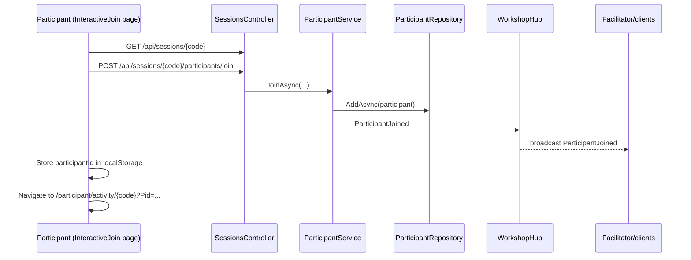
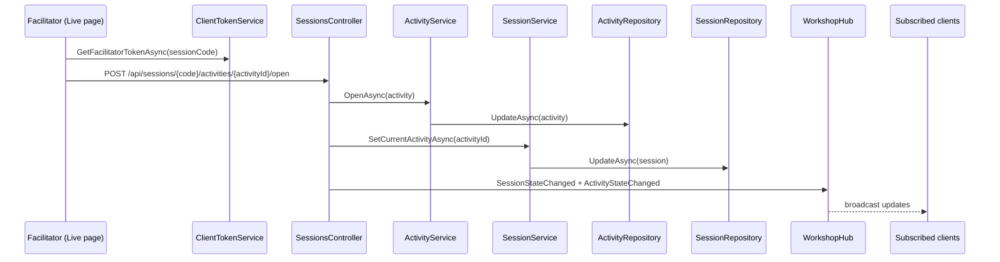
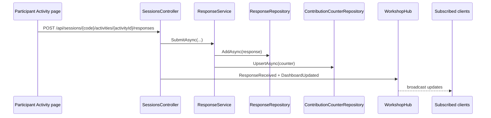

# TechWayFit Pulse - Architecture Review Report (code-scan-17jan-2026-codex)

Date: 2026-01-17
Author: Codex (Solution Architecture Review)

## Scope
- Solution structure: `TechWayFit.Pulse.sln`
- Key runtime components: Blazor Server UI, API controllers, SignalR hub, EF Core persistence
- Sampled files:
  - `src/TechWayFit.Pulse.Web/Program.cs`
  - `src/TechWayFit.Pulse.Web/Controllers/Api/SessionsController.cs`
  - `src/TechWayFit.Pulse.Web/Hubs/WorkshopHub.cs`
  - `src/TechWayFit.Pulse.Application/Services/*`
  - `src/TechWayFit.Pulse.Infrastructure/Persistence/*`
  - `src/TechWayFit.Pulse.Web/Pages/Facilitator/*.razor`
  - `src/TechWayFit.Pulse.Web/Pages/Participant/*.razor`
  - `src/TechWayFit.Pulse.Web/Components/Dashboards/*.razor`

## Architecture Snapshot
- Layering follows Web -> Application -> Domain; Infrastructure implements repository interfaces; Contracts holds DTOs and enums.
- Single ASP.NET Core host provides MVC + Blazor Server + Minimal API controllers + SignalR.
- Persistence uses EF Core with SQLite or InMemory; activity configs and responses are stored as JSON strings.
- Real-time events are pushed via SignalR: SessionStateChanged, ActivityStateChanged, ResponseReceived, DashboardUpdated.

## Findings (Severity Ordered)

### Critical
1) Facilitator controls can be invoked without any valid facilitator token
- Impact: Any caller can start/end sessions and open/close activities if no facilitator token exists yet.
- Evidence: `RequireFacilitatorToken` returns null (allow) when no token exists.
- References: `src/TechWayFit.Pulse.Web/Controllers/Api/SessionsController.cs:720-734`

2) Facilitator token can be minted by anyone who knows a session code
- Impact: Any participant can call the join facilitator endpoint and obtain full control of the session.
- Evidence: Join endpoint is anonymous and only checks session code.
- References: `src/TechWayFit.Pulse.Web/Controllers/Api/SessionsController.cs:125-137`

### High
3) Session and activity APIs are unauthenticated and not scoped to facilitator identity
- Impact: Unauthorized callers can create sessions, add activities, change join forms, or assign sessions to groups.
- Evidence: SessionsController lacks [Authorize] and does not validate facilitator ownership; group assignment has no ownership checks.
- References: `src/TechWayFit.Pulse.Web/Controllers/Api/SessionsController.cs:14-226`, `src/TechWayFit.Pulse.Web/Controllers/Api/SessionsController.cs:225-259`, `src/TechWayFit.Pulse.Application/Services/SessionService.cs:89-132`

4) OTP generation is not cryptographically secure
- Impact: OTPs are predictable under some conditions and reduce login security.
- Evidence: Uses `new Random()` for OTPs.
- References: `src/TechWayFit.Pulse.Application/Services/AuthenticationService.cs:174-178`

5) Participant identity is client-asserted; responses can be spoofed
- Impact: Anyone can submit responses as any participant ID in the same session.
- Evidence: `SubmitResponse` trusts `request.ParticipantId` without authentication or token.
- References: `src/TechWayFit.Pulse.Web/Controllers/Api/SessionsController.cs:494-534`

### Medium
6) Contribution limits and counters are not transactionally safe
- Impact: Concurrent submissions can exceed contribution limits or desync counters.
- Evidence: Counter read, response insert, and counter update are separate operations.
- References: `src/TechWayFit.Pulse.Application/Services/ResponseService.cs:90-126`, `src/TechWayFit.Pulse.Infrastructure/Persistence/Repositories/ContributionCounterRepository.cs:30-46`

7) Dashboards scale poorly due to full in-memory aggregation
- Impact: Large sessions will read all responses into memory and parse JSON per request; CPU and memory will grow quickly.
- Evidence: Dashboard services fetch all responses and filter/aggregate in memory.
- References: `src/TechWayFit.Pulse.Application/Services/DashboardService.cs:31-133`, `src/TechWayFit.Pulse.Application/Services/PollDashboardService.cs:27-155`

8) Activity ordering is hardcoded to 1 in create pages
- Impact: New activities can collide in ordering and appear incorrectly.
- Evidence: `order = 1` placeholder in create forms.
- References: `src/TechWayFit.Pulse.Web/Pages/Facilitator/CreatePollActivity.razor:236-247`, `src/TechWayFit.Pulse.Web/Pages/Facilitator/CreateWordCloudActivity.razor:236-247`

### Low
9) Participant session cleanup JavaScript object name mismatch
- Impact: LocalStorage cleanup never runs, leading to stale participant session data.
- Evidence: C# invokes `participantSession.*` but JS defines `pulseParticipantSession`.
- References: `src/TechWayFit.Pulse.Web/Pages/Participant/Activity.razor:956-964`, `src/TechWayFit.Pulse.Web/Pages/Participant/DoneView.razor:99-110`, `src/TechWayFit.Pulse.Web/wwwroot/js/participant-session.js:1-69`

10) Local UI config classes duplicate domain models
- Impact: Client-side config types can drift from domain configuration and create subtle runtime bugs.
- Evidence: PollConfig/GeneralFeedbackConfig redefined in the page.
- References: `src/TechWayFit.Pulse.Web/Pages/Participant/Activity.razor:987-1020`

11) Database lifecycle uses EnsureCreated instead of migrations
- Impact: Schema drift risks in production and uneven migration history handling.
- Evidence: `EnsureCreated` used even though migrations exist.
- References: `src/TechWayFit.Pulse.Web/Program.cs:170-177`

12) Session join does not validate session status or expiry
- Impact: Participants can join ended or expired sessions.
- Evidence: Join logic does not check session status or expiration.
- References: `src/TechWayFit.Pulse.Application/Services/ParticipantService.cs:39-77`

## Category Review

### Code Quality
- Strengths: Separation of concerns between Web/Application/Domain/Infrastructure; DTOs in Contracts; use of typed SignalR hub.
- Risks: UI layer includes duplicated config models and placeholder logic; JS object mismatch and ordering logic show gaps in end-to-end validation; use of static caches in Blazor server services can leak state between users.

### Security
- Key risks: Facilitator token issuance is unauthenticated; token validation can be bypassed when missing; participant identity is not authenticated; OTP generation not cryptographically secure.
- Recommendations: Require authenticated facilitator identity for session control; bind facilitator actions to facilitator user ID; use cryptographic RNG for OTPs and session codes; sign or encrypt participant identity (or issue a participant token on join).

### Scalability
- Bottlenecks: In-memory aggregation for dashboards, lack of caching, and SQLite for larger sessions. SignalR uses in-memory group management without a backplane.
- Recommendations: Pre-aggregate dashboards, introduce caching, and consider a distributed store for responses; add SignalR backplane (Redis) if scaling out; move tokens to distributed cache.

### Reusability
- Strengths: Contracts layer provides shared DTOs and enums.
- Risks: Duplicate config models in UI and Web-specific ApiResponse class reduce reuse and clarity.

### Complexity
- Strengths: Core workflows are easy to follow; service boundaries are simple.
- Risks: Flow logic is split across UI, services, and repositories without orchestration patterns; manual synchronization for activity ordering and state transitions increases operational complexity.

### Best Practices
- Good: Dependency injection, typed SignalR hub, explicit repositories.
- Gaps: EnsureCreated in production, no migrations execution, use of non-crypto RNG for auth codes, no rate limiting by IP, no audit logging for facilitator actions.

### Extensibility
- Strengths: Activity types are represented by enums and JSON configs for flexibility.
- Risks: New activity types require updates across UI, service aggregation, and JS; dashboards are hardwired to Poll/WordCloud.
- Recommendations: Introduce an activity strategy registry and typed config validation per activity type; use a single shared config model in Contracts.

## Process Flow Diagrams

### 1) Create Activity (Poll or WordCloud)


### 2) Facilitator Start Session


### 3) Participant Join Session


### 4) Facilitator Control Session (Open/Close Activity)


### 5) SignalR Connections on Blazor Pages

#### 5.i Facilitator Live page
```mermaid
flowchart TD
    A[Live.razor OnInitializedAsync] --> B[HubConnection to /hubs/workshop]
    B --> C[Subscribe(sessionCode)]
    C --> D[Handle SessionStateChanged]
    C --> E[Handle ParticipantJoined]
    C --> F[Handle ResponseReceived]
    C --> G[Handle DashboardUpdated]
    D --> H[Update participant count]
    F --> I[Trigger UI refresh]
```

#### 5.ii Activity dashboards (Poll and WordCloud)
```mermaid
flowchart TD
    A[Dashboard component OnInitializedAsync] --> B[HubConnection to /hubs/workshop]
    B --> C[Subscribe(sessionCode)]
    C --> D[ResponseReceived or DashboardUpdated]
    D --> E[GET dashboard API]
    E --> F[Render chart via JS]
```

#### 5.iii Participant submission flow


### 6) Login and Session Management
```mermaid
flowchart TD
    A[GET /account/login] --> B[POST /account/login]
    B --> C[AuthenticationService.SendLoginOtpAsync]
    C --> D[LoginOtpRepository.AddAsync]
    C --> E[EmailService.SendLoginOtpAsync]
    E --> F[POST /account/verify-otp]
    F --> G[AuthenticationService.VerifyOtpAsync]
    G --> H[LoginOtpRepository.GetValidOtpAsync + UpdateAsync]
    G --> I[FacilitatorUserRepository Add/Update]
    F --> J[Set auth cookie]
    J --> K[FacilitatorTokenMiddleware]
    K --> L[FacilitatorTokenService.GetOrCreateTokenAsync]
    L --> M[Context.Items["FacilitatorToken"]]
```

## Testing Gaps
- No automated tests for controller-level authorization, facilitator token validation, or participant identity checks.
- No load or integration tests for SignalR events or dashboard aggregation performance.
- No concurrency tests around contribution limits.

## Recommendations (Shortlist)
- Enforce authenticated facilitator identity for all session control endpoints; bind tokens to facilitator user ID.
- Replace weak RNG usage for OTP and session codes with cryptographic RNG.
- Add participant tokens (or signed cookies) to prevent participant ID spoofing.
- Make response submission and counter updates transactional; consider optimistic concurrency.
- Move dashboards to pre-aggregated or cached views; avoid per-request full scan for large sessions.
- Replace `EnsureCreated` with migrations for production.
- Remove placeholder activity ordering and compute next order server-side.
- Align JS interop names for participant session cleanup; centralize client config models in Contracts.

## Open Questions
- Should facilitator access be limited to authenticated users only, or is a session code intended to grant facilitator control?
- Are session codes expected to be public or private? Should participant join require rate limiting or additional validation?
- What is the target scale for concurrent participants per session?
