# Technical Process Flows — TechWayFit Pulse

> Platform: .NET 8 Blazor Server with SignalR | Date: January 2026

All diagrams use Mermaid syntax and render in VS Code (Markdown Preview) or GitHub.

---

## Table of Contents

1. [Create Activity Flow](#1-create-activity-flow)
2. [Facilitator Start Session Flow](#2-facilitator-start-session-flow)
3. [Participant Join Session Flow](#3-participant-join-session-flow)
4. [Facilitator Control Session Flow](#4-facilitator-control-session-flow)
5. [Activity State Diagram](#5-activity-state-diagram)
6. [SignalR Connection — Facilitator Live Page](#6-signalr-connection--facilitator-live-page)
7. [SignalR Connection — Activity Dashboards](#7-signalr-connection--activity-dashboards)
8. [Participant Response Submission Flow](#8-participant-response-submission-flow)
9. [Login and OTP Authentication Flow](#9-login-and-otp-authentication-flow)
10. [AI Session Generation Flow](#10-ai-session-generation-flow)
11. [SignalR Connection State Machine](#11-signalr-connection-state-machine)

---

## 1. Create Activity Flow

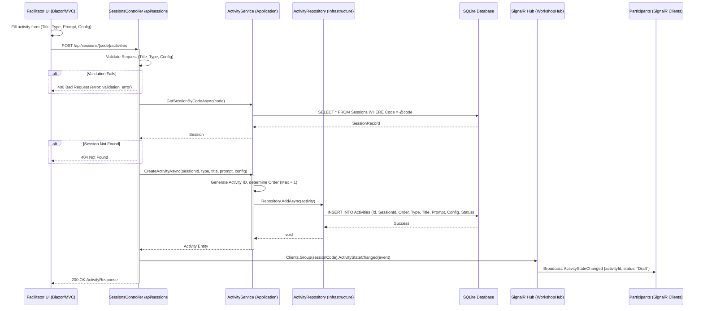

**Business Rules**:
- Activity order auto-assigned (max existing order + 1)
- New activities default to `Draft` status
- Only the session owner can create activities
- Validates title (required, max 200 chars) and type-specific config

---

## 2. Facilitator Start Session Flow

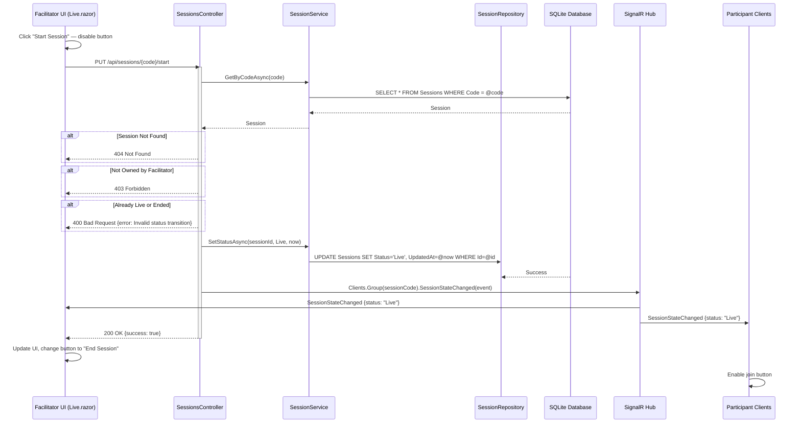

**State transition**: `Draft → Live`

---

## 3. Participant Join Session Flow

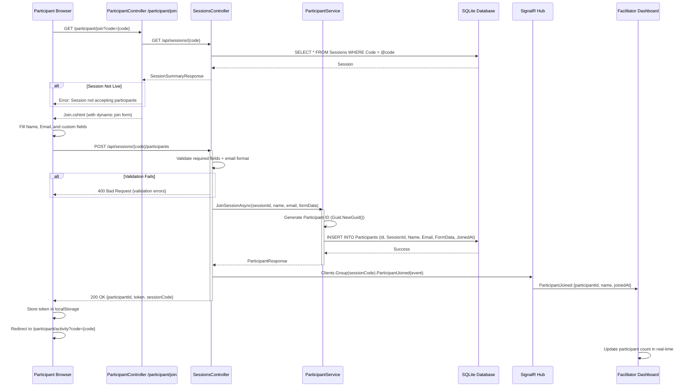

---

## 4. Facilitator Control Session Flow

### Open / Close / Switch Activity

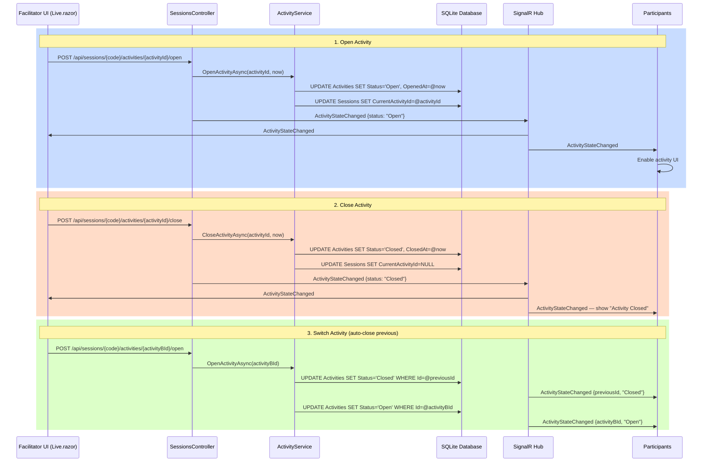

---

## 5. Activity State Diagram

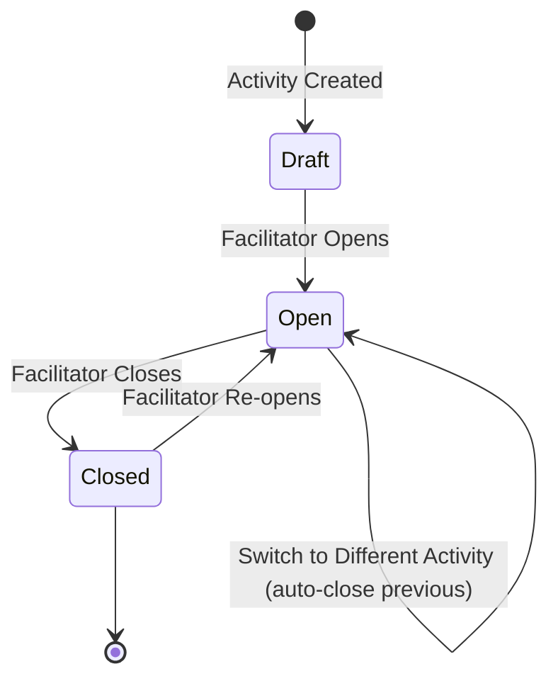

**Business Rules**:
- Only one activity can be `Open` at a time per session
- Opening a new activity automatically closes the currently open one
- Closed activities can be re-opened
- Only the session owner controls activity state

---

## 6. SignalR Connection — Facilitator Live Page

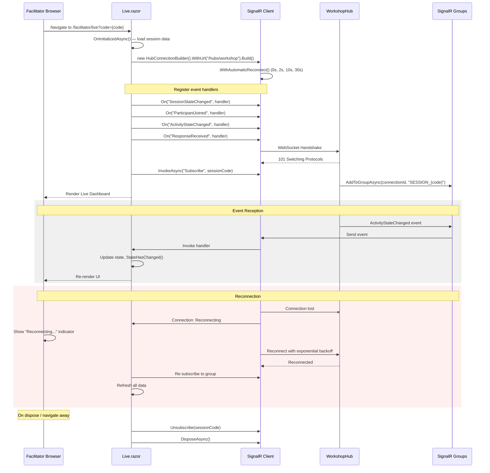

### SignalR Event Reference

| Event | Payload | Triggers |
|-------|---------|---------|
| `SessionStateChanged` | `{ sessionId, status }` | Session start / end |
| `ParticipantJoined` | `{ participantId, name, joinedAt }` | New participant joins |
| `ActivityStateChanged` | `{ activityId, status, openedAt?, closedAt? }` | Activity open / close |
| `ResponseReceived` | `{ activityId, participantId, responseData }` | Participant submits |
| `DashboardUpdated` | `{ activityId, aggregateType, payload }` | Aggregate recalculated or AI insight ready |

---

## 7. SignalR Connection — Activity Dashboards

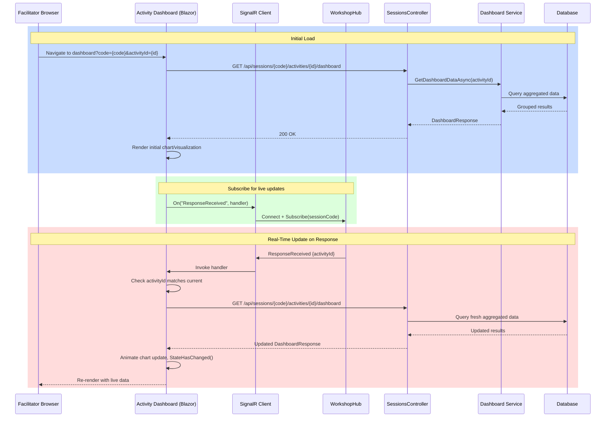

**Performance tip**: Debounce rapid updates (use 500ms delay) to avoid unnecessary API calls when many participants submit simultaneously.

---

## 8. Participant Response Submission Flow

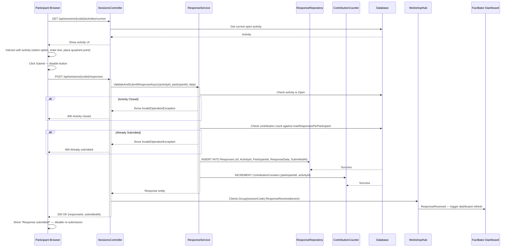

---

## 9. Login and OTP Authentication Flow

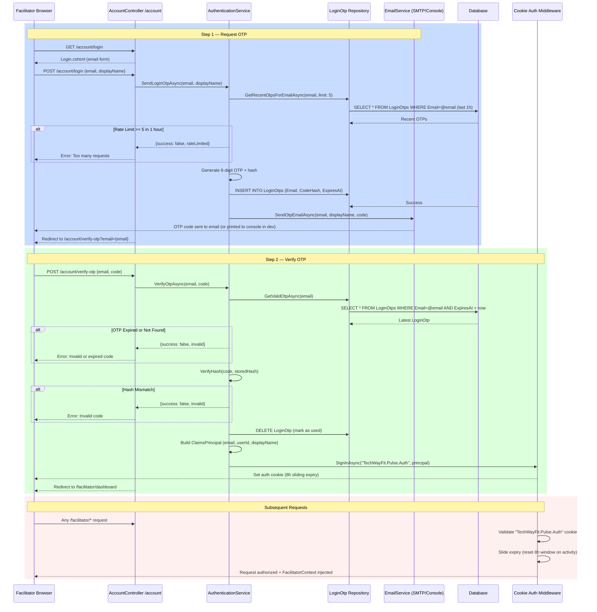

**Cookie settings**: 8-hour sliding expiry; `HttpOnly`; `SameSite=Strict`.

---

## 10. AI Session Generation Flow

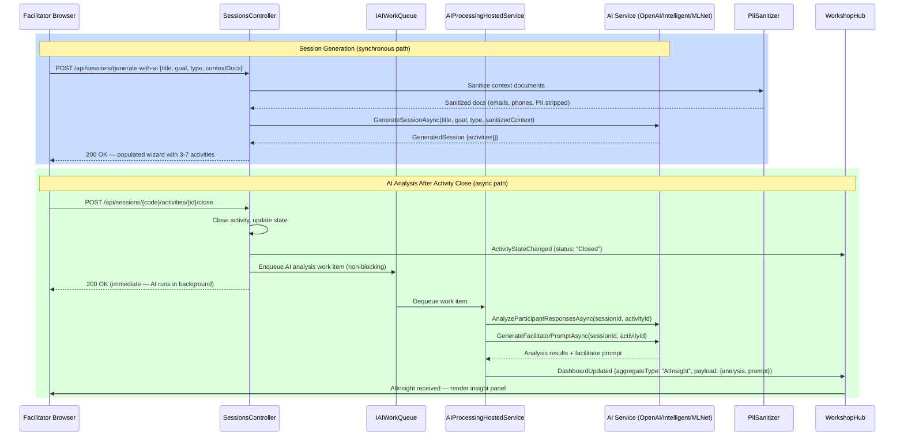

**Key behaviors**:
- Session generation is synchronous (facilitator waits for result, typically < 5s)
- Post-activity AI analysis is async — HTTP response returns immediately, insights arrive via SignalR
- If AI is disabled or errors, mock services return instant stubs; no UX degradation

---

## 11. SignalR Connection State Machine

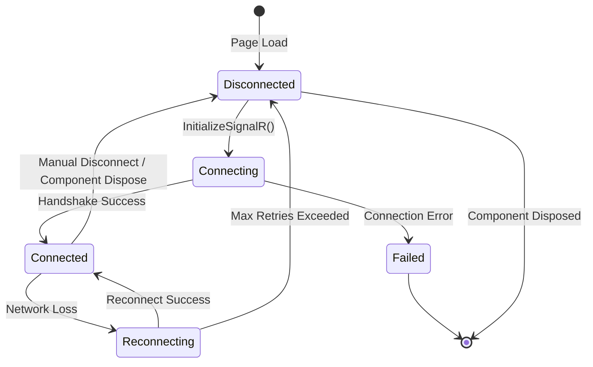

**Reconnection backoff**: 0s, 2s, 10s, 30s (`.WithAutomaticReconnect()`)

**On reconnect**: client re-subscribes to session group and refreshes all data from API.
