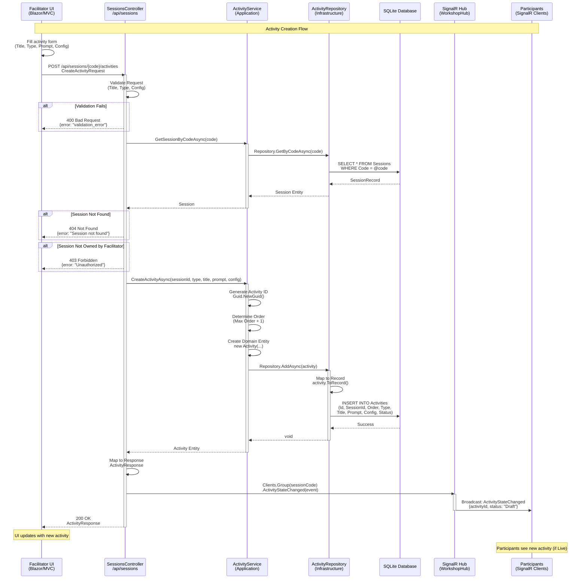
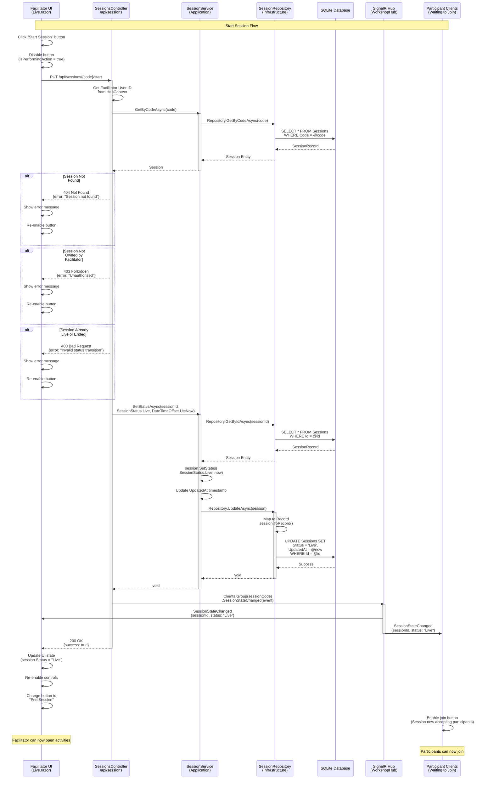
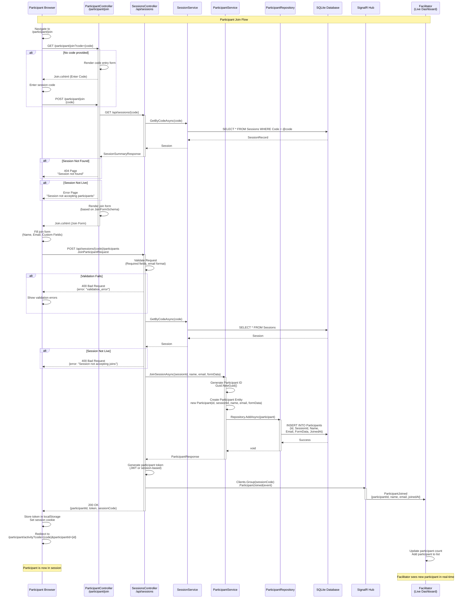
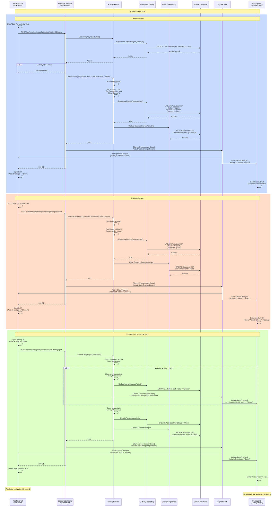
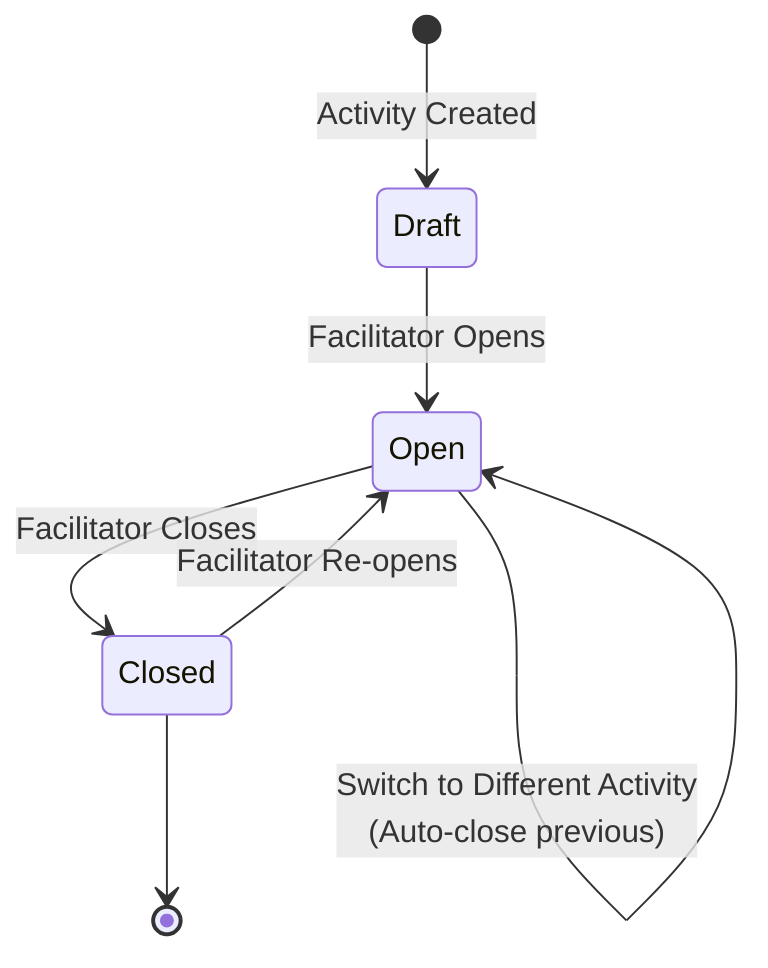
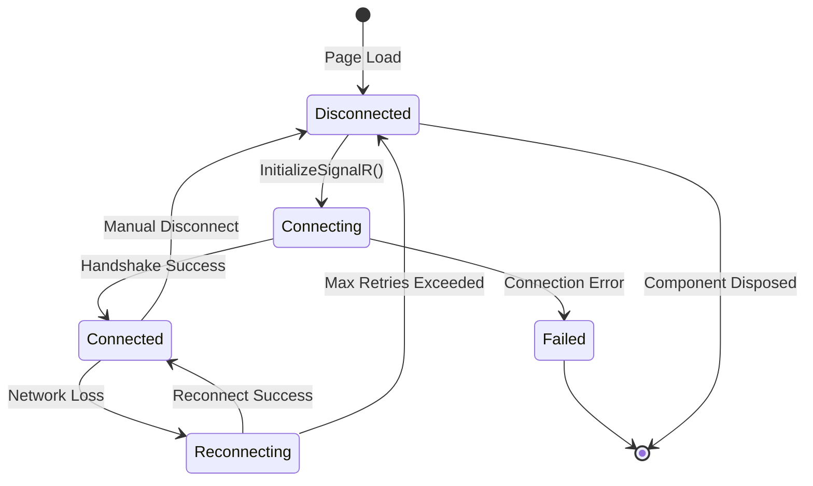
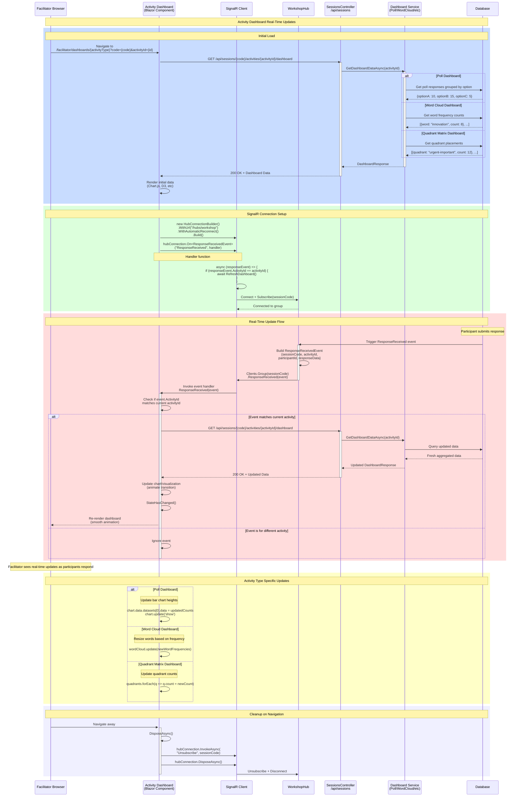
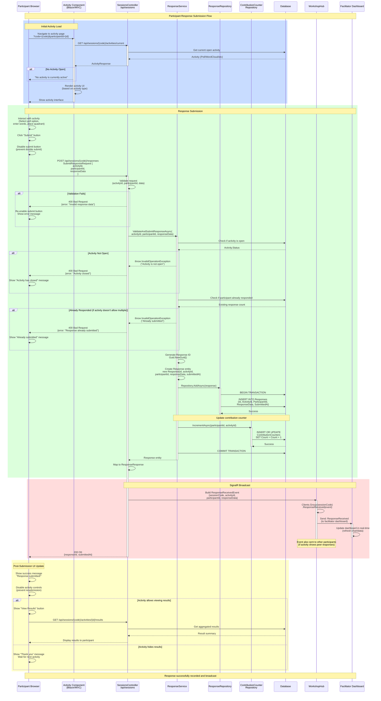
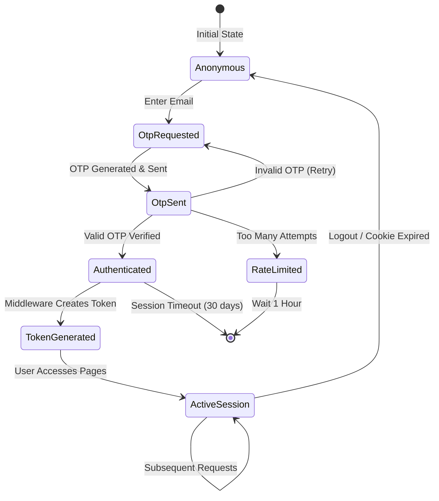

# TechWayFit Pulse - Process Flow Diagrams
**Date:** January 17, 2026  
**Platform:** .NET 8 Blazor Server with SignalR  

---

## Table of Contents
1. [Create Activity Flow](#1-create-activity-flow)
2. [Facilitator Start Session Flow](#2-facilitator-start-session-flow)
3. [Participant Join Session Flow](#3-participant-join-session-flow)
4. [Facilitator Control Session Flow](#4-facilitator-control-session-flow)
5. [SignalR Connection - Facilitator Live Page](#5-signalr-connection---facilitator-live-page)
6. [SignalR Connection - Activity Type Dashboards](#6-signalr-connection---activity-type-dashboards)
7. [SignalR Connection - Participant Submission](#7-signalr-connection---participant-submission)
8. [Login and Session Management Flow](#8-login-and-session-management-flow)

---

## 1. Create Activity Flow

### Overview
This flow describes how a facilitator creates an activity within a session, including validation, persistence, and real-time notifications.



### Key Components:

1. **Request Validation**
   - Title required and ≤ 200 chars
   - ActivityType enum validation
   - Config JSON validation (activity-type specific)

2. **Business Rules**
   - Activity order auto-assigned (max + 1)
   - New activities default to "Draft" status
   - Only facilitator who owns session can create activities

3. **Real-Time Notification**
   - SignalR broadcasts `ActivityStateChanged` event
   - All connected clients in session group receive update
   - Facilitator dashboard and participant views auto-update

---

## 2. Facilitator Start Session Flow

### Overview
This flow shows how a facilitator transitions a session from "Draft" to "Live" status, enabling participant access.



### Key State Transitions:

```
Draft → Live → Ended
  ↓      ↓
Valid  Valid
```

### Business Rules:

1. Only session owner (facilitator) can start session
2. Session must be in "Draft" status to start
3. Once started, session accepts participant joins
4. Session TTL countdown begins (typically 6 hours)
5. All connected clients notified in real-time

---

## 3. Participant Join Session Flow

### Overview
This flow details how a participant joins a live session, submits join form data, and receives a participant token.



### Join Form Validation:

```csharp
// JoinFormSchema structure
{
  "fields": [
    {
      "name": "name",
      "label": "Your Name",
      "type": "text",
      "required": true
    },
    {
      "name": "email",
      "label": "Email Address",
      "type": "email",
      "required": true
    },
    {
      "name": "organization",
      "label": "Organization",
      "type": "text",
      "required": false
    }
  ]
}
```

### Security Considerations:

1. Session code validated before showing join form
2. Email format validation
3. Rate limiting on join endpoint (prevent spam)
4. Participant token generated for subsequent requests
5. Session must be "Live" to accept joins

---

## 4. Facilitator Control Session Flow

### Overview
This flow shows how facilitators control activities (open, close, switch) during a live session.



### Activity State Diagram:



### Business Rules:

1. **Single Active Activity**: Only one activity can be "Open" at a time per session
2. **Auto-Close Previous**: Opening a new activity automatically closes the currently open one
3. **Re-open Allowed**: Closed activities can be re-opened
4. **Real-Time Sync**: All state changes broadcast via SignalR
5. **Authorization**: Only session owner can control activities

---

## 5. SignalR Connection - Facilitator Live Page

### Overview
Detailed flow showing how the facilitator's live dashboard establishes and maintains SignalR connection.

```mermaid
sequenceDiagram
    participant Browser as Facilitator Browser
    participant Blazor as Live.razor<br/>(Blazor Component)
    participant JS as JavaScript Runtime
    participant SRClient as SignalR Client<br/>(HubConnection)
    participant Server as ASP.NET Core Server
    participant Hub as WorkshopHub
    participant Groups as SignalR Groups

    Note over Browser,Groups: Facilitator Live Page - SignalR Connection

    Browser->>Blazor: Navigate to /facilitator/live?code={code}
    activate Blazor
    
    Blazor->>Blazor: OnInitializedAsync()
    Blazor->>Blazor: Load session data<br/>sessionCode = QueryString["code"]
    
    Blazor->>Blazor: Call InitializeSignalR()
    
    Blazor->>SRClient: new HubConnectionBuilder()<br/>.WithUrl("/hubs/workshop")<br/>.Build()
    activate SRClient
    
    Note over SRClient: Configure reconnection
    SRClient->>SRClient: .WithAutomaticReconnect()<br/>(0s, 2s, 10s, 30s delays)
    
    Note over SRClient: Register event handlers
    
    rect rgb(200, 220, 255)
        Note over Blazor,SRClient: Register Event: SessionStateChanged
        Blazor->>SRClient: hubConnection.On<SessionStateChangedEvent><br/>("SessionStateChanged", handler)
        SRClient->>SRClient: Store handler:<br/>async (sessionEvent) => {<br/>  session.Status = sessionEvent.Status<br/>  await InvokeAsync(StateHasChanged)<br/>}
    end

    rect rgb(220, 255, 220)
        Note over Blazor,SRClient: Register Event: ParticipantJoined
        Blazor->>SRClient: hubConnection.On<ParticipantJoinedEvent><br/>("ParticipantJoined", handler)
        SRClient->>SRClient: Store handler:<br/>async (participantEvent) => {<br/>  participantCount++<br/>  await InvokeAsync(StateHasChanged)<br/>}
    end

    rect rgb(255, 220, 220)
        Note over Blazor,SRClient: Register Event: ActivityStateChanged
        Blazor->>SRClient: hubConnection.On<ActivityStateChangedEvent><br/>("ActivityStateChanged", handler)
        SRClient->>SRClient: Store handler:<br/>async (activityEvent) => {<br/>  UpdateActivityInList(activityEvent)<br/>  await InvokeAsync(StateHasChanged)<br/>}
    end

    rect rgb(255, 255, 200)
        Note over Blazor,SRClient: Register Event: ResponseReceived
        Blazor->>SRClient: hubConnection.On<ResponseReceivedEvent><br/>("ResponseReceived", handler)
        SRClient->>SRClient: Store handler:<br/>async (responseEvent) => {<br/>  await RefreshDashboardData()<br/>}
    end

    Note over SRClient: Start connection
    SRClient->>Server: WebSocket Handshake<br/>GET /hubs/workshop
    activate Server
    Server->>Server: Negotiate transport<br/>(WebSockets preferred)
    Server-->>SRClient: 101 Switching Protocols
    SRClient-->>Blazor: Connection State: Connected
    deactivate Server

    Blazor->>SRClient: hubConnection.InvokeAsync(<br/>"Subscribe", sessionCode)
    activate SRClient
    SRClient->>Server: RPC: Subscribe(sessionCode)
    activate Server
    Server->>Hub: Subscribe(sessionCode)
    activate Hub
    
    Hub->>Hub: Validate sessionCode
    Hub->>Groups: AddToGroupAsync(<br/>Context.ConnectionId,<br/>sessionCode)
    activate Groups
    Groups->>Groups: Add connection to group<br/>"SESSION_{code}"
    Groups-->>Hub: void
    deactivate Groups
    
    Hub-->>Server: void
    deactivate Hub
    Server-->>SRClient: Success
    deactivate Server
    SRClient-->>Blazor: Subscribed successfully
    deactivate SRClient

    Blazor->>Blazor: isLoading = false<br/>StateHasChanged()
    Blazor-->>Browser: Render Live Dashboard
    deactivate Blazor

    Note over Browser,Groups: Connection established, listening for events

    rect rgb(240, 240, 240)
        Note over Browser,Groups: Event Reception Example
        
        Server->>Hub: Activity opened by facilitator
        activate Hub
        Hub->>Groups: Clients.Group(sessionCode)<br/>.ActivityStateChanged(event)
        activate Groups
        Groups->>SRClient: Send: ActivityStateChanged<br/>{activityId, status: "Open"}
        deactivate Groups
        deactivate Hub
        
        SRClient->>Blazor: Invoke handler:<br/>ActivityStateChanged(event)
        activate Blazor
        Blazor->>Blazor: Update activity in local state<br/>activities[i].Status = event.Status
        Blazor->>Blazor: await InvokeAsync(StateHasChanged)
        Blazor-->>Browser: Re-render UI with updated activity
        deactivate Blazor
    end

    rect rgb(255, 240, 240)
        Note over Browser,Groups: Reconnection Scenario
        
        SRClient-xServer: Connection lost<br/>(network issue)
        SRClient->>SRClient: OnReconnecting event
        SRClient->>Blazor: Connection state: Reconnecting
        Blazor->>Browser: Show "Reconnecting..." indicator

        SRClient->>Server: Attempt reconnect<br/>(with exponential backoff)
        Server-->>SRClient: Reconnected
        
        SRClient->>SRClient: OnReconnected event
        SRClient->>Blazor: Connection state: Connected
        
        Blazor->>SRClient: Re-subscribe to group<br/>InvokeAsync("Subscribe", sessionCode)
        SRClient->>Hub: Subscribe(sessionCode)
        Hub->>Groups: AddToGroupAsync(newConnectionId, sessionCode)
        
        Blazor->>Blazor: Refresh all data<br/>(session, activities, participants)
        Blazor-->>Browser: Hide reconnection indicator<br/>Update UI with fresh data
    end

    Note over Browser,Groups: Component disposal
    
    Browser->>Blazor: Navigate away / close tab
    activate Blazor
    Blazor->>Blazor: DisposeAsync()
    
    Blazor->>SRClient: hubConnection.InvokeAsync(<br/>"Unsubscribe", sessionCode)
    SRClient->>Hub: Unsubscribe(sessionCode)
    Hub->>Groups: RemoveFromGroupAsync(<br/>connectionId, sessionCode)
    
    Blazor->>SRClient: hubConnection.DisposeAsync()
    SRClient->>Server: Close WebSocket connection
    Server-->>SRClient: Connection closed
    deactivate Blazor
```



### Connection Lifecycle:



### Configuration:

```csharp
// Program.cs - SignalR configuration
builder.Services.AddSignalR(options =>
{
    options.KeepAliveInterval = TimeSpan.FromSeconds(15);  // Ping clients every 15s
    options.ClientTimeoutInterval = TimeSpan.FromSeconds(30);  // Disconnect if no response in 30s
    options.HandshakeTimeout = TimeSpan.FromSeconds(15);  // Handshake timeout
    options.MaximumReceiveMessageSize = 32 * 1024;  // 32KB message limit
});
```

### Event Types:

| Event Name | Payload | Triggered By | Purpose |
|------------|---------|--------------|---------|
| `SessionStateChanged` | `{sessionId, status}` | Session start/end | Update session status badge |
| `ParticipantJoined` | `{participantId, name, email, joinedAt}` | Participant joins | Increment participant count |
| `ActivityStateChanged` | `{activityId, status, openedAt?, closedAt?}` | Activity open/close | Update activity cards |
| `ResponseReceived` | `{activityId, participantId, responseData}` | Participant submits | Refresh dashboard data |

---

## 6. SignalR Connection - Activity Type Dashboards

### Overview
This flow shows SignalR connections for real-time activity dashboards (Poll, Word Cloud, Quadrant Matrix).



### Dashboard-Specific Logic:

#### Poll Dashboard
```csharp
// Real-time update handler
hubConnection.On<ResponseReceivedEvent>("ResponseReceived", async (evt) =>
{
    if (evt.ActivityId == activityId)
    {
        var updatedData = await ApiService.GetPollDashboardAsync(sessionCode, activityId);
        
        // Update Chart.js data
        pollChart.data.datasets[0].data = updatedData.OptionCounts;
        pollChart.update('show');  // Animate transition
        
        await InvokeAsync(StateHasChanged);
    }
});
```

#### Word Cloud Dashboard
```csharp
// Real-time update handler
hubConnection.On<ResponseReceivedEvent>("ResponseReceived", async (evt) =>
{
    if (evt.ActivityId == activityId)
    {
        var updatedData = await ApiService.GetWordCloudDashboardAsync(sessionCode, activityId);
        
        // Update word cloud visualization
        await JS.InvokeVoidAsync("updateWordCloud", updatedData.WordFrequencies);
        
        await InvokeAsync(StateHasChanged);
    }
});
```

### Performance Optimization:

1. **Debouncing**: If multiple responses arrive rapidly, debounce dashboard refreshes
```csharp
private CancellationTokenSource _debounceTokenSource;

private async Task RefreshDashboardDebounced()
{
    _debounceTokenSource?.Cancel();
    _debounceTokenSource = new CancellationTokenSource();
    
    try
    {
        await Task.Delay(500, _debounceTokenSource.Token);  // 500ms debounce
        await RefreshDashboard();
    }
    catch (TaskCanceledException) { }
}
```

2. **Incremental Updates**: Instead of fetching all data, fetch only changed data
```csharp
// Instead of full refresh
var allData = await GetAllDashboardData();

// Incremental update
var deltaData = await GetDashboardDataSince(lastUpdateTimestamp);
MergeIntoExistingData(deltaData);
```

---

## 7. SignalR Connection - Participant Submission

### Overview
This flow shows how participant responses are submitted and broadcast via SignalR.



### Response Data Formats:

#### Poll Response
```json
{
  "activityId": "uuid",
  "participantId": "uuid",
  "responseData": {
    "selectedOptionId": "option-a"
  }
}
```

#### Word Cloud Response
```json
{
  "activityId": "uuid",
  "participantId": "uuid",
  "responseData": {
    "words": ["innovation", "teamwork", "agility"]
  }
}
```

#### Quadrant Matrix Response
```json
{
  "activityId": "uuid",
  "participantId": "uuid",
  "responseData": {
    "quadrant": "urgent-important",
    "item": "Improve CI/CD pipeline"
  }
}
```

### Duplicate Submission Prevention:

```csharp
// Client-side (JavaScript/Blazor)
let isSubmitting = false;

async function submitResponse() {
    if (isSubmitting) return;
    isSubmitting = true;
    
    try {
        await fetch('/api/sessions/{code}/responses', {
            method: 'POST',
            body: JSON.stringify(data)
        });
    } finally {
        isSubmitting = false;
    }
}

// Server-side (C#)
public async Task<ActionResult> SubmitResponse(SubmitResponseRequest request)
{
    var existingResponse = await _responses.GetByParticipantAndActivityAsync(
        request.ParticipantId, request.ActivityId);
    
    if (existingResponse != null && !activity.AllowMultipleResponses)
    {
        return BadRequest(new { error = "Response already submitted" });
    }
    
    // Process submission...
}
```

---

## 8. Login and Session Management Flow

### Overview
Comprehensive flow showing OTP-based authentication and session management for facilitators.

```mermaid
sequenceDiagram
    participant F as Facilitator Browser
    participant AC as AccountController<br/>/account
    participant Auth as AuthenticationService
    participant FUR as FacilitatorUser<br/>Repository
    participant OTP as LoginOtp<br/>Repository
    participant Email as EmailService<br/>(SMTP/Console)
    participant DB as Database
    participant Cookie as Cookie Auth<br/>Middleware
    participant Token as FacilitatorToken<br/>Service (Memory Cache)

    Note over F,Token: Facilitator Login Flow (OTP-based)

    rect rgb(200, 220, 255)
        Note over F,Email: Step 1: Request OTP
        
        F->>AC: GET /account/login
        AC-->>F: Login.cshtml (Email form)
        
        F->>F: Enter email address<br/>& optional display name
        F->>AC: POST /account/login<br/>{email, displayName}
        activate AC
        
        AC->>AC: Validate email format
        
        alt Invalid Email
            AC-->>F: Show validation error
        end
        
        AC->>Auth: SendLoginOtpAsync(email, displayName)
        activate Auth
        
        Auth->>Auth: Normalize email<br/>email.ToLowerInvariant()
        
        Note over Auth,DB: Rate Limiting Check
        Auth->>OTP: GetRecentOtpsForEmailAsync(email, limit: 5)
        OTP->>DB: SELECT * FROM LoginOtps<br/>WHERE Email = @email<br/>ORDER BY CreatedAt DESC<br/>LIMIT 5
        DB-->>OTP: Recent OTPs
        OTP-->>Auth: List<LoginOtp>
        
        Auth->>Auth: Count OTPs in last hour
        
        alt Rate Limit Exceeded (>= 5 in 1 hour)
            Auth-->>AC: SendOtpResult<br/>{success: false,<br/>message: "Too many requests"}
            AC-->>F: Error: "Too many OTP requests.<br/>Try again later."
        end
        
        Note over Auth,DB: Generate OTP
        Auth->>Auth: GenerateOtpCode()<br/>(6-digit random number)
        Auth->>Auth: Create LoginOtp entity<br/>new LoginOtp(id, email, code,<br/>createdAt, expiresAt: now + 10min)
        
        Auth->>OTP: Repository.AddAsync(otp)
        OTP->>DB: INSERT INTO LoginOtps<br/>(Id, Email, OtpCode,<br/>CreatedAt, ExpiresAt)
        DB-->>OTP: Success
        
        Note over Auth,Email: Send OTP Email
        Auth->>FUR: GetByEmailAsync(email)
        FUR->>DB: SELECT * FROM FacilitatorUsers<br/>WHERE Email = @email
        DB-->>FUR: User (if exists)
        FUR-->>Auth: FacilitatorUser?
        
        Auth->>Auth: Determine display name<br/>userName = existingUser?.DisplayName<br/>         ?? displayName<br/>         ?? "there"
        
        Auth->>Email: SendLoginOtpAsync(<br/>email, otpCode, userName)
        activate Email
        
        alt SMTP Provider
            Email->>Email: Build HTML email from template
            Email->>Email: Connect to SMTP server
            Email->>Email: Send via SMTP
            Email-->>Auth: Success
        else Console Provider (Dev)
            Email->>Email: Console.WriteLine(<br/>"OTP for {email}: {otpCode}")
            Email-->>Auth: Success
        end
        deactivate Email
        
        Auth-->>AC: SendOtpResult<br/>{success: true,<br/>message: "OTP sent"}
        deactivate Auth
        
        AC->>AC: Store email in TempData
        AC-->>F: Redirect to /account/verify-otp
        deactivate AC
        
        F-->>F: Show OTP verification form
    end

    rect rgb(220, 255, 220)
        Note over F,DB: Step 2: Verify OTP
        
        F->>AC: GET /account/verify-otp
        AC-->>F: VerifyOtp.cshtml (OTP input)
        
        F->>F: Enter 6-digit OTP code<br/>(received via email)
        F->>AC: POST /account/verify-otp<br/>{email, otpCode}
        activate AC
        
        AC->>Auth: VerifyOtpAsync(email, otpCode)
        activate Auth
        
        Auth->>Auth: Normalize inputs<br/>email.ToLowerInvariant()<br/>otpCode.Trim()
        
        Auth->>OTP: GetValidOtpAsync(email, otpCode)
        activate OTP
        OTP->>DB: SELECT * FROM LoginOtps<br/>WHERE Email = @email<br/>  AND OtpCode = @code<br/>  AND ExpiresAt > @now<br/>LIMIT 1
        DB-->>OTP: LoginOtp (if valid)
        OTP-->>Auth: LoginOtp?
        deactivate OTP
        
        alt OTP Not Found or Expired
            Auth-->>AC: VerifyOtpResult<br/>{success: false,<br/>errorMessage: "Invalid or expired OTP"}
            AC-->>F: Error: "Invalid OTP code"
        end
        
        Note over Auth,DB: Get or Create User
        Auth->>FUR: GetByEmailAsync(email)
        FUR->>DB: SELECT * FROM FacilitatorUsers<br/>WHERE Email = @email
        DB-->>FUR: User (if exists)
        FUR-->>Auth: FacilitatorUser?
        
        alt User Doesn't Exist
            Auth->>Auth: Create new user<br/>new FacilitatorUser(<br/>  id: Guid.NewGuid(),<br/>  email: email,<br/>  displayName: displayName,<br/>  createdAt: now)
            
            Auth->>FUR: Repository.AddAsync(user)
            FUR->>DB: INSERT INTO FacilitatorUsers<br/>(Id, Email, DisplayName,<br/>CreatedAt)
            DB-->>FUR: Success
        end
        
        Auth->>Auth: Mark OTP as used<br/>(delete or flag)
        Auth->>OTP: DeleteAsync(otp)
        OTP->>DB: DELETE FROM LoginOtps<br/>WHERE Id = @id
        
        Auth-->>AC: VerifyOtpResult<br/>{success: true,<br/>user: FacilitatorUser}
        deactivate Auth
    end

    rect rgb(255, 220, 220)
        Note over AC,Cookie: Step 3: Create Authentication Session
        
        AC->>AC: Build Claims<br/>claims = [<br/>  {ClaimTypes.NameIdentifier, userId},<br/>  {ClaimTypes.Email, email},<br/>  {ClaimTypes.Name, displayName},<br/>  {"FacilitatorRole", "Facilitator"}<br/>]
        
        AC->>AC: Create ClaimsIdentity<br/>identity = new ClaimsIdentity(<br/>  claims,<br/>  CookieAuthenticationDefaults.AuthenticationScheme)
        
        AC->>AC: Create ClaimsPrincipal<br/>principal = new ClaimsPrincipal(identity)
        
        AC->>Cookie: SignInAsync(<br/>  principal,<br/>  authProperties: {<br/>    IsPersistent: true,<br/>    ExpiresUtc: now + 30 days<br/>  })
        
        activate Cookie
        Cookie->>Cookie: Encrypt authentication ticket
        Cookie->>Cookie: Create auth cookie<br/>"TechWayFit.Pulse.Auth"
        Cookie-->>F: Set-Cookie: TechWayFit.Pulse.Auth=<encrypted>;<br/>HttpOnly; Secure; SameSite=Lax;<br/>Expires=...
        deactivate Cookie
        
        AC-->>F: Redirect to /facilitator/dashboard
        deactivate AC
    end

    rect rgb(255, 255, 200)
        Note over F,Token: Step 4: Generate Facilitator Token
        
        F->>F: Navigate to /facilitator/dashboard
        F->>Cookie: Send request with auth cookie
        
        Cookie->>Cookie: Validate cookie
        Cookie->>Cookie: Decrypt authentication ticket
        Cookie->>Cookie: Populate HttpContext.User<br/>with claims
        
        Note over Cookie,Token: FacilitatorTokenMiddleware executes
        
        Cookie->>Token: Middleware: GetOrCreateTokenAsync(userId)
        activate Token
        
        Token->>Token: Check memory cache<br/>cacheKey = "facilitator_token_{userId}"
        
        alt Token Exists in Cache
            Token-->>Cookie: Return existing token
        else Token Not in Cache
            Token->>Token: GenerateSecureToken()<br/>(32 random bytes, Base64)
            Token->>Token: Store in cache<br/>_cache.Set(cacheKey, token,<br/>  expiration: now + 6 hours)
            Token->>Token: Store reverse lookup<br/>_cache.Set("token_user_{token}", userId)
            Token-->>Cookie: Return new token
        end
        deactivate Token
        
        Cookie->>Cookie: Store token in HttpContext.Items<br/>context.Items["FacilitatorToken"] = token
        
        Cookie-->>F: Render dashboard page<br/>(user authenticated)
    end

    rect rgb(240, 240, 255)
        Note over F,Token: Step 5: Subsequent Requests
        
        F->>AC: Any facilitator request<br/>(e.g., create session)
        
        AC->>Cookie: Validate auth cookie
        Cookie->>Cookie: Check cookie validity
        
        alt Cookie Valid
            Cookie->>Cookie: Populate User claims
            Cookie->>Token: Get/Create token (via middleware)
            Token-->>Cookie: Token
            Cookie-->>AC: Authenticated request<br/>+ HttpContext.User populated
            AC->>AC: Process request with<br/>authenticated user context
        else Cookie Invalid/Expired
            Cookie-->>F: Redirect to /account/login<br/>(LoginPath configured)
        end
    end

    rect rgb(255, 240, 240)
        Note over F,Cookie: Step 6: Logout
        
        F->>AC: POST /account/logout
        activate AC
        
        AC->>Cookie: SignOutAsync(<br/>  CookieAuthenticationDefaults.AuthenticationScheme)
        activate Cookie
        Cookie->>Cookie: Delete auth cookie
        Cookie-->>F: Set-Cookie: TechWayFit.Pulse.Auth=;<br/>Expires=(past date)
        deactivate Cookie
        
        AC->>Token: RevokeTokenAsync(userId)
        activate Token
        Token->>Token: Remove from cache<br/>_cache.Remove("facilitator_token_{userId}")<br/>_cache.Remove("token_user_{token}")
        deactivate Token
        
        AC-->>F: Redirect to /
        deactivate AC
        
        F->>F: Show logged out state
    end

    Note over F,Token: Authentication complete
```

### Authentication State Diagram:



### Security Measures:

1. **OTP Security**
   - 6-digit random code
   - 10-minute expiration
   - Single-use (deleted after verification)
   - Rate limiting (5 attempts per hour)

2. **Cookie Security**
   ```csharp
   options.Cookie.HttpOnly = true;        // Prevent XSS access
   options.Cookie.SecurePolicy = CookieSecurePolicy.Always;  // HTTPS only
   options.Cookie.SameSite = SameSiteMode.Lax;  // CSRF protection
   options.ExpireTimeSpan = TimeSpan.FromDays(30);  // Long-lived
   options.SlidingExpiration = true;  // Renew on activity
   ```

3. **Token Security**
   - 32-byte random tokens (256-bit)
   - 6-hour expiration
   - Stored in memory (not persisted to disk)
   - Revoked on logout

4. **Data Protection**
   - File-based key storage for cookie encryption
   - Keys protected with Data Protection API

### Session Flow Summary:

| Step | Action | Duration | Storage |
|------|--------|----------|---------|
| 1 | Request OTP | - | Temporary (TempData) |
| 2 | Verify OTP | 10 min expiry | Database (LoginOtps) |
| 3 | Create Auth Session | 30 days | Encrypted Cookie |
| 4 | Generate Facilitator Token | 6 hours | Memory Cache |
| 5 | Authenticated Requests | Session lifetime | Cookie + Cache |
| 6 | Logout | - | Remove Cookie + Cache |

---

## Summary

These process flow diagrams provide a comprehensive view of the TechWayFit Pulse application's key workflows:

1. **Create Activity**: Shows the complete flow from UI interaction to database persistence and real-time broadcasting
2. **Start Session**: Details the state transition and participant enablement process
3. **Participant Join**: Demonstrates the join form submission and token generation
4. **Control Session**: Illustrates how facilitators manage activity states in real-time
5. **Facilitator SignalR**: Details the connection lifecycle for the live dashboard
6. **Dashboard SignalR**: Shows real-time updates for activity-specific visualizations
7. **Participant Submission**: Complete flow from response submission to broadcast
8. **Login & Session**: Comprehensive OTP-based authentication and session management

Each diagram includes:
- Detailed sequence flows
- Error handling paths
- State transitions
- Security considerations
- Performance optimizations

These diagrams serve as both documentation and architectural reference for development, testing, and scaling the platform.

---

**Document Created:** January 17, 2026  
**Last Updated:** January 17, 2026  
**Maintained By:** Solution Architecture Team
